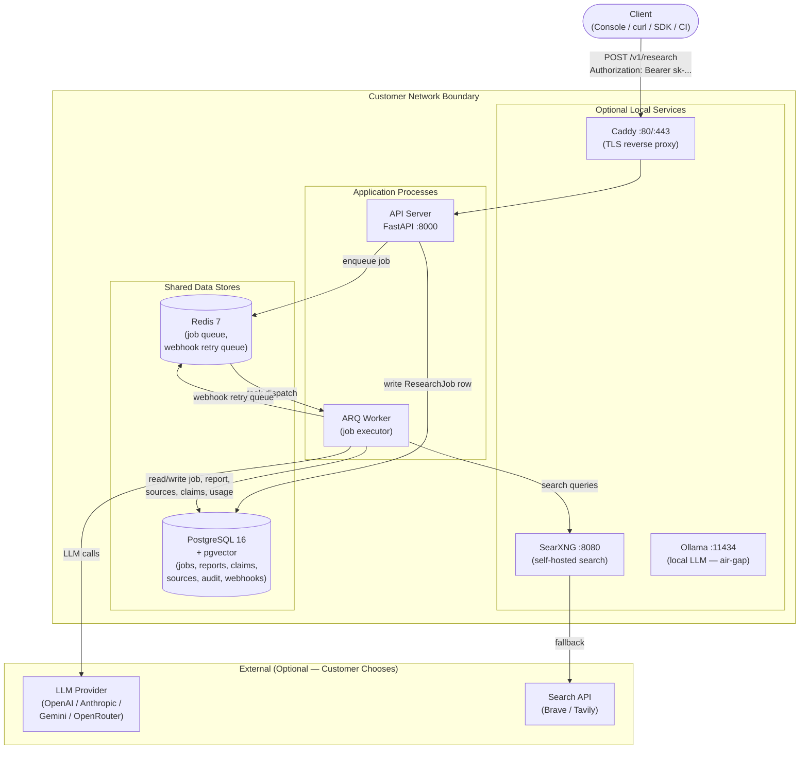

# Vanta Architecture & 15-Stage Pipeline

Vanta is a **Queue-Based Modular Monolith** with four process types communicating through two shared data stores.

---

## High-Level Architecture

---

## The 15-Stage Deep Research Pipeline

Rather than relying on naive single-shot prompts, Vanta executes an autonomous, multi-phase research engine:

```mermaid
flowchart LR
    S1["1. Understand<br/>(Scope & Mode)"] --> S2["2. Plan<br/>(Hypotheses)"]
    S2 --> S3["3. Multi-Family<br/>Search Fleet"]
    S3 --> S4["4. Parallel Fetch<br/>& Content Extractor"]
    S4 --> S5["5. Source Validator<br/>(Trust Scoring)"]
    S5 --> S6["6. Atomic Claims<br/>Normalization"]
    S6 --> S7["7. Contradiction<br/>& Conflict Matrix"]
    S7 --> S8["8. Challenge Fleet<br/>(Falsification)"]
    S8 --> S9["9. Gap Analysis<br/>& Loop Decision"]
    S9 -- "Needs More Depth" --> S3
    S9 -- "Knowledge Complete" --> S10["10. Evidence Audit"]
    S10 --> S11["11. Report Plan"]
    S11 --> S12["12. Synthesis<br/>(Draft Report)"]
    S12 --> S13["13. Claim Verification"]
    S13 --> S14["14. Citation Entailment"]
    S14 --> S15["15. Editorial Polish<br/>& Quality Gate"]
```

### Stage Details

1. **Query Understanding**: Classifies research scope into `Research`, `Study`, `Brief`, or `Deep`.
2. **Research Plan**: Generates multi-angle hypotheses and search strategies.
3. **Multi-Family Search**: Queries distributed engines (SearXNG, academic whitepapers, news).
4. **Fetcher & Extractor**: Headless content retrieval with HTML sanitization.
5. **Validator**: Domain authority scoring (0–100) discarding spam and low-trust sources.
6. **Atomic Evidence Graph**: Typed claims (Fact, Measurement, Announcement, Forecast).
7. **Contradiction Detection**: Cross-source comparison identifying factual conflicts.
8. **Adversarial Falsification**: ChallengeAgent attacks emerging conclusions to test robustness.
9. **Gap Analysis**: Identifies missing evidence; triggers subsequent search rounds if needed.
10. **Evidence Audit**: Verifies that every theme has at least two corroborating sources.
11. **Report Architecture Plan**: Structures section layout, BLUF, and pedagogical breakdowns.
12. **Synthesizer**: Writes comprehensive, authoritative dossier.
13. **Claim Verifier**: Line-by-line verification ensuring all numbers and quotes exist in sources.
14. **Citation Entailment**: Strict citation checking verifying semantic grounding.
15. **Editorial Polish & Quality Gate**: Polishes prose, fixes formatting, and generates metadata.
