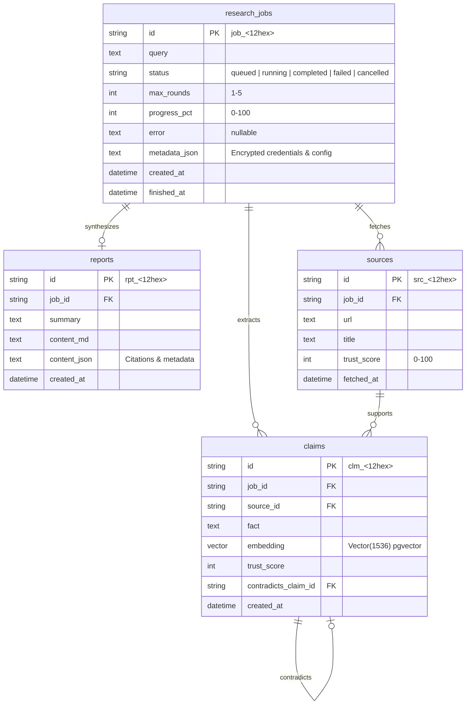

# Vanta Database & Schema Design

Vanta uses **PostgreSQL 16** with the **`pgvector`** extension to persist research state, atomic facts, and vector embeddings for semantic recall.

---

## Entity-Relationship Diagram



---

## Running Migrations

Database schema migrations are managed via Alembic:

```bash
# Upgrade to latest revision
uv run python scripts/migrate.py
```
